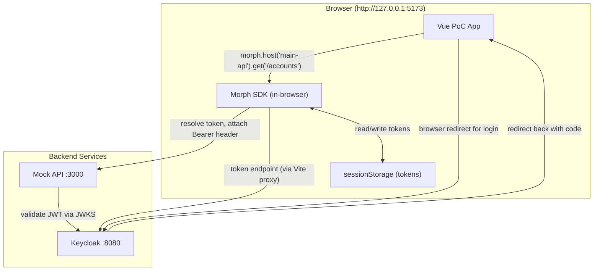
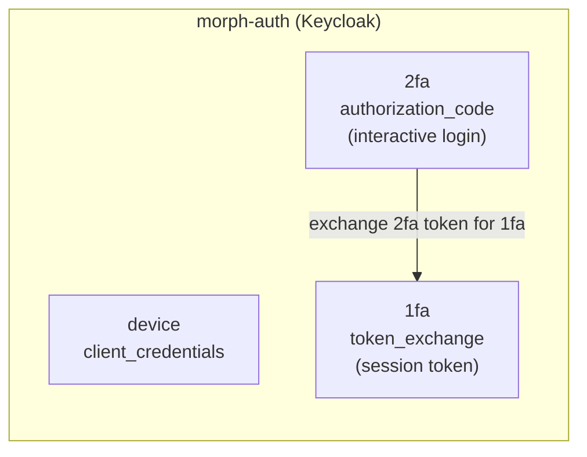
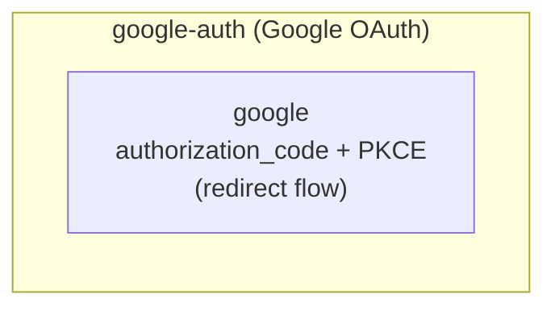
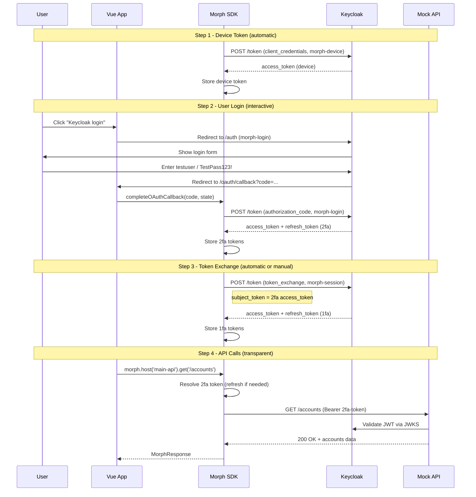

# Project Overview

Morph API Client is a **config-driven, multi-context HTTP client** with built-in OAuth2 token lifecycle management. The SDK handles token acquisition, storage, refresh, exchange, and recovery transparently so the host application never manages tokens directly.

This document provides a visual overview of how all the pieces fit together.

---

## System Architecture



**How it works:**

1. The Vue app makes API calls through the SDK: `morph.host('main-api').get('/accounts')`
2. The SDK resolves the appropriate token for the request (refresh if expired, exchange if needed)
3. The SDK attaches the `Authorization: Bearer <token>` header and sends the request to the Mock API
4. The Mock API validates the JWT against Keycloak's JWKS endpoint
5. Tokens are stored in the browser's `sessionStorage` (prefixed `morph-poc:tk:`)

---

## Auth Providers and Contexts

The SDK organizes authentication into **providers** (auth servers) and **contexts** (token types within a provider). Each context has its own grant type, storage policy, and lifecycle.

### Keycloak Provider (`morph-auth`)



### Google Provider (`google-auth`)



---

## Keycloak Client Mapping

Each SDK auth context maps to a specific Keycloak client. This is the most important table in the project:

| SDK Auth ID | Keycloak Client | Grant Type | Purpose | Token Lifetime |
|---|---|---|---|---|
| `morph-auth/device` | `morph-device` | `client_credentials` | Machine-level API access without user login | 15s access |
| `morph-auth/2fa` | `morph-login` | `authorization_code` | Interactive user login (browser redirect to Keycloak) | 30s access, 60s refresh idle |
| `morph-auth/1fa` | `morph-session` | `token_exchange` (RFC 8693) | Long-lived session derived from 2fa login | 20s access, 60s refresh idle |
| `google-auth/google` | (Google Cloud OAuth) | `authorization_code` + PKCE | External identity verification | Google-managed |

**Why "2fa" for login and "1fa" for session?** The naming reflects the authentication assurance level, not the order of acquisition. The 2fa context represents a fresh interactive login (higher assurance), while 1fa is a derived session token (lower assurance, longer-lived).

---

## Auth Flow: Login and Token Exchange

This is the complete flow from unauthenticated to fully authenticated:



---

## Host Configuration

Hosts define API servers and which auth contexts can be used with them:

| Host Key | Base URL | Allowed Auth IDs | Purpose |
|---|---|---|---|
| `main-api` | `http://localhost:3000` | `morph-auth/device`, `morph-auth/1fa`, `morph-auth/2fa`, `google-auth/google` | Mock banking API |
| `google-api` | `https://www.googleapis.com` | `google-auth/google` | Google APIs |

Each request through `morph.host('main-api')` must specify an `auth` parameter (or the host must have a `defaultAuth`). The SDK validates the auth ID against the host's `allowedAuth` list at request time.

---

## Token Storage Model

Different contexts store tokens differently based on security and lifetime requirements:

| Context | Storage Type | Scope | Where | Survives Reload? | Survives New Tab? |
|---|---|---|---|---|---|
| `morph-auth/device` | persistent / secure | device | sessionStorage | Yes | No (sessionStorage) |
| `morph-auth/2fa` | memory / secure | session | sessionStorage | Yes | No |
| `morph-auth/1fa` | persistent / encrypted | user | sessionStorage | Yes | No |
| `google-auth/google` | memory / secure | session | sessionStorage | Yes | No |

All tokens use the browser's `sessionStorage` with the prefix `morph-poc:tk:`. The SDK's `StorageProvider` interface abstracts the actual storage mechanism, so production apps can use Keychain, Keystore, or encrypted storage.

---

## Mock API Endpoints

The Mock API at `http://localhost:3000` validates Keycloak JWTs and provides test endpoints:

### Public (no auth required)

| Method | Path | Description |
|---|---|---|
| GET | `/health` | Health check |
| GET | `/public/config` | App configuration |
| GET | `/sim/not-found` | Returns 404 (simulation probe) |

### Protected (Keycloak JWT required)

| Method | Path | Auth Level | Description |
|---|---|---|---|
| GET | `/accounts` | device, 1fa, or 2fa | List bank accounts |
| POST | `/transfers` | device, 1fa, or 2fa | Create a transfer |
| GET | `/profile` | device, 1fa, or 2fa | User profile |

### Google (Google token required)

| Method | Path | Description |
|---|---|---|
| GET | `/identity/verify` | Verify Google identity |

The Mock API determines the auth level from the JWT's `azp` (authorized party) claim:
- `azp: morph-device` -> auth level: `device`
- `azp: morph-login` -> auth level: `2fa`
- `azp: morph-session` -> auth level: `1fa`

---

## Environment Variables

The Vue PoC app uses `VITE_*` environment variables (loaded from `poc/ts-vue/.env`):

| Variable | Required | Default | Purpose |
|---|---|---|---|
| `VITE_DEVICE_CLIENT_SECRET` | Yes | (empty) | Secret for `morph-device` Keycloak client |
| `VITE_LOGIN_CLIENT_SECRET` | Yes | (empty) | Secret for `morph-login` Keycloak client |
| `VITE_SESSION_CLIENT_SECRET` | Yes | (empty) | Secret for `morph-session` Keycloak client |
| `VITE_KEYCLOAK_ORIGIN` | No | `http://localhost:8080` | Keycloak base URL |
| `VITE_OAUTH_REDIRECT_URI` | No | `{origin}/oauth/callback` | OAuth callback URL (auto-detected in dev) |
| `VITE_DEVICE_ID` | No | (auto UUID) | Pin device ID for demos |
| `VITE_INSTALLATION_ID` | No | (auto UUID) | Pin installation ID for demos |
| `VITE_GOOGLE_CLIENT_ID` | No | (empty) | Google OAuth client ID |
| `VITE_GOOGLE_CLIENT_SECRET` | No | (empty) | Google OAuth client secret |
| `VITE_SIMULATION_MODE` | No | (unset) | When `true`, sets 5s proactive refresh on all contexts |
| `VITE_MOCK_API_BASE` | No | `http://localhost:3000` | Mock API base URL |

Copy `poc/ts-vue/.env.example` to `poc/ts-vue/.env` to get started. The three client secrets are required for any token operations to work.

---

## Project Structure

```
morph-api-client/
├── core/                       # SDK npm package (morph-api-client)
│   └── src/
│       ├── client/             # MorphClient, HostClient, AuthHandle
│       ├── config/             # Config validation, variable interpolation
│       ├── tokens/             # TokenLifecycle, TokenVault
│       ├── http/               # HostPipeline (requests + 401 recovery)
│       ├── oauth/              # Token HTTP, authorization URL builder
│       ├── util/               # JWT, expiry, URL helpers
│       ├── storage/            # Browser storage factories
│       ├── runtime.ts          # MorphRuntime coordinator
│       ├── types.ts            # Public type definitions
│       └── errors.ts           # Error classes
├── poc/
│   ├── ts-vue/                 # Vue 3 PoC app
│   │   ├── src/views/          # HomeView, OAuthCallbackView
│   │   ├── src/components/     # PocSimulationPanel
│   │   ├── src/morph.ts        # SDK initialization + config
│   │   └── .env.example        # Environment template
│   ├── keycloak/               # Docker Keycloak + setup scripts
│   │   ├── docker-compose.yml  # Keycloak container
│   │   ├── morph-realm.json    # Realm export (auto-imported)
│   │   ├── setup.sh            # Full setup (clients + lifetimes + tests)
│   │   └── test-flows.sh       # OAuth flow smoke tests
│   └── mock-api/               # Express mock API
│       └── server.js           # JWT validation + test endpoints
├── docs/                       # Documentation
│   └── poc/                    # PoC-specific config files
│       ├── poc-config.json     # SDK config for Vue PoC
│       └── poc-simulation.json # Simulation step definitions
├── Makefile                    # Build + run targets
└── README.md                   # Quick start
```

---

## Next Steps

- [PoC Guide](poc-guide.md) -- Step-by-step walkthrough of the Vue app
- [Getting Started](getting-started.md) -- SDK usage for your own app
- [Architecture](architecture.md) -- Internal design and module structure
- [Troubleshooting](troubleshooting.md) -- Common errors and fixes
