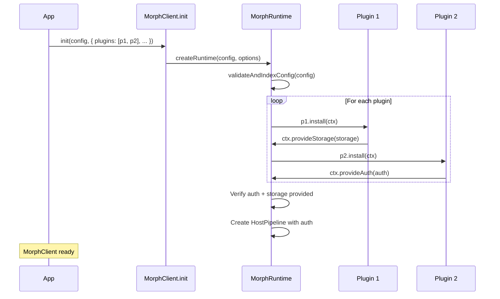

# Writing Plugins

Morph uses a plugin system to keep the core SDK small and extensible. Plugins register capabilities (auth, storage, or custom behavior) during initialization. The core never needs to change when a new plugin is added.

---

## Plugin Interface

Every plugin implements the `MorphPlugin` interface:

```typescript
import type { MorphPlugin, MorphPluginContext } from '@morph/core';

interface MorphPlugin {
  name: string;
  install(ctx: MorphPluginContext): void;
  dispose?(): void;
}
```

| Field | Description |
|-------|-------------|
| `name` | Unique identifier for the plugin (convention: npm package name) |
| `install(ctx)` | Called once during `MorphClient.init()` with the resolved config and options |
| `dispose()` | Optional. Called when `MorphClient.dispose()` is invoked. Use for cleanup (timers, listeners, etc.) |

---

## Plugin Context

The `install` method receives a `MorphPluginContext` with access to config and registration methods:

```typescript
interface MorphPluginContext {
  resolved: ResolvedMorphConfig;
  options: MorphOptions;
  variables: Record<string, string>;
  provideAuth(auth: AuthPlugin): void;
  provideStorage(storage: StorageProvider): void;
}
```

| Field | Description |
|-------|-------------|
| `resolved` | Validated and indexed config (providers, contexts, hosts, auth id maps) |
| `options` | The full `MorphOptions` passed to `MorphClient.init()` |
| `variables` | Resolved variable map for `$variable` interpolation |
| `provideAuth(auth)` | Register an `AuthPlugin` implementation. Exactly one plugin must call this. |
| `provideStorage(storage)` | Register a `StorageProvider` implementation. Exactly one plugin must call this. |

---

## How Plugins Are Loaded



**Order matters.** Plugins are installed in array order. If the auth plugin needs storage during init (e.g., `@morph/oauth2` reads tokens from storage), the storage plugin must come first:

```typescript
plugins: [
  browserStoragePlugin('myapp:tk:'),  // storage first
  oauth2Plugin(),                      // auth second (uses storage)
]
```

---

## Built-in Plugins

### `@morph/oauth2` -- Auth Plugin

Provides OAuth2 token lifecycle management (refresh, exchange, client credentials, authorization code).

```typescript
import { oauth2Plugin } from '@morph/oauth2';

plugins: [
  oauth2Plugin(),
]
```

Calls `ctx.provideAuth()` with a `TokenLifecycle` instance that implements the `AuthPlugin` interface.

### `@morph/browser-storage` -- Storage Plugin

Provides `sessionStorage` or `localStorage` based token persistence.

```typescript
import { browserStoragePlugin } from '@morph/browser-storage';

plugins: [
  browserStoragePlugin('myapp:tk:'),            // sessionStorage (default)
  browserStoragePlugin('myapp:tk:', 'local'),    // localStorage
]
```

Calls `ctx.provideStorage()` with a `StorageProvider` backed by browser storage.

---

## Writing a Custom Storage Plugin

The simplest plugin type. Implement the `StorageProvider` interface and register it via `ctx.provideStorage()`.

```typescript
import type { MorphPlugin, StorageProvider, StorageConfig } from '@morph/core';

function secureStoragePlugin(encryptionKey: string): MorphPlugin {
  const memoryCache = new Map<string, string>();

  async function encrypt(value: string): Promise<string> {
    // Use Web Crypto API, Node.js crypto, or platform keychain
    return btoa(value); // placeholder
  }

  async function decrypt(value: string): Promise<string> {
    return atob(value); // placeholder
  }

  const provider: StorageProvider = {
    async read(key, config) {
      if (config.type === 'memory') return memoryCache.get(key) ?? null;
      const raw = localStorage.getItem(key);
      if (!raw) return null;
      return config.protection === 'encrypted' ? decrypt(raw) : raw;
    },

    async write(key, value, config) {
      if (config.type === 'memory') { memoryCache.set(key, value); return; }
      const stored = config.protection === 'encrypted' ? await encrypt(value) : value;
      localStorage.setItem(key, stored);
    },

    async delete(key, config) {
      if (config.type === 'memory') { memoryCache.delete(key); return; }
      localStorage.removeItem(key);
    },

    async deleteByPrefix(prefix, config) {
      if (config.type === 'memory') {
        for (const k of memoryCache.keys()) if (k.startsWith(prefix)) memoryCache.delete(k);
        return;
      }
      for (let i = localStorage.length - 1; i >= 0; i--) {
        const k = localStorage.key(i);
        if (k?.startsWith(prefix)) localStorage.removeItem(k);
      }
    },
  };

  return {
    name: 'secure-storage',
    install(ctx) {
      ctx.provideStorage(provider);
    },
  };
}
```

Usage:

```typescript
MorphClient.init(config, {
  plugins: [
    secureStoragePlugin('my-encryption-key'),
    oauth2Plugin(),
  ],
  callbacks: { ... },
});
```

---

## Writing a Custom Auth Plugin

For non-OAuth2 auth schemes (API keys, custom token servers, biometric flows). Implement the `AuthPlugin` interface and register via `ctx.provideAuth()`.

```typescript
import type { MorphPlugin, AuthPlugin, CtxRef, TokenSet, LogoutReason, AuthContextConfig } from '@morph/core';

function apiKeyPlugin(apiKey: string): MorphPlugin {
  const auth: AuthPlugin = {
    async resolveAccessToken(_authId, _ref, _mode) {
      return apiKey;
    },
    async handle401Recovery() {
      throw new Error('API key rejected');
    },
    fireAuthRequired(_authId, _ctx) { /* no-op for static keys */ },
    async submitCode() { throw new Error('Not supported'); },
    async acquireWithClientCredentials() { /* no-op */ },
    async exchangeToken() { throw new Error('Not supported'); },
    async setTokens() { /* no-op */ },
    async clearTokens() { /* no-op */ },
    async loadTokens() { return { accessToken: apiKey }; },
    async logout() { /* no-op */ },
    async logoutProvider() { /* no-op */ },
    async hasValidTokenContext() { return true; },
    async hasValidTokenProvider() { return true; },
    async refreshTokensManual() { /* no-op */ },
    dispose() { /* no-op */ },
  };

  return {
    name: 'api-key-auth',
    install(ctx) {
      ctx.provideAuth(auth);
    },
  };
}
```

For more complex auth plugins, look at `@morph/oauth2`'s `TokenLifecycle` as a reference implementation.

---

## Writing a Utility Plugin

Not all plugins need to provide auth or storage. A plugin can hook into the system for logging, analytics, or other cross-cutting concerns by reading from the context.

```typescript
import type { MorphPlugin } from '@morph/core';

function requestLoggerPlugin(): MorphPlugin {
  return {
    name: 'request-logger',
    install(ctx) {
      const original = ctx.options.onHttpTrace;
      ctx.options.onHttpTrace = (event) => {
        console.log(`[${event.method}] ${event.url} -> ${event.statusCode} (${event.durationMs}ms)`);
        original?.(event);
      };
    },
  };
}
```

---

## Constraints

- Exactly **one** plugin must call `ctx.provideAuth()`. Zero or more than one is an error.
- Exactly **one** plugin must call `ctx.provideStorage()`. Zero or more than one is an error.
- Plugins are installed **synchronously** in array order. `install()` is not async.
- A plugin's `dispose()` is called when `MorphClient.dispose()` is invoked. Use for timer cleanup, event listener removal, etc.
- Plugin names should be unique for debugging purposes but are not enforced at runtime.

---

## Full Example: Custom Encrypted Storage + OAuth2

```typescript
import { MorphClient } from '@morph/core';
import { oauth2Plugin } from '@morph/oauth2';
import config from './morph-config.json';

const morph = MorphClient.init(config, {
  plugins: [
    secureStoragePlugin('encryption-key-from-keychain'),
    oauth2Plugin(),
    requestLoggerPlugin(),
  ],
  callbacks: {
    onAuthRequired: (authId, metadata) => { /* ... */ },
    onLogout: (authId, reason) => { /* ... */ },
  },
  variables: { /* ... */ },
});
```

---

## Next Steps

- [API Reference](api-reference.md) -- `MorphPlugin`, `MorphPluginContext`, `AuthPlugin`, `StorageProvider` type definitions
- [Platform Adapters](platform-adapters.md) -- `StorageProvider` interface details and `NetworkDelegate`
- [Token Lifecycle](token-lifecycle.md) -- How `AuthPlugin.resolveAccessToken` fits into the token resolution algorithm
